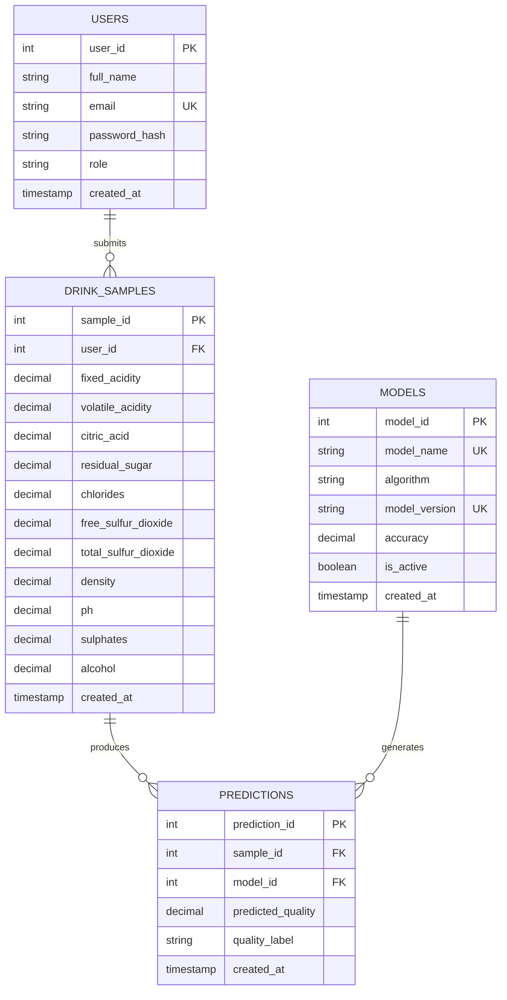

# Drinks Quality Prediction System - Project SRS

## Week 5 Database Design

The Week 5 prototype stores user accounts, machine learning model metadata, the eleven physicochemical values submitted for a drink sample, and the prediction produced for that sample. MySQL/MariaDB enforces the relationships, while the PHP module uses PDO prepared statements to authenticate users and display prediction history.

### Entity-relationship diagram

`model_name` and `model_version` form one composite unique constraint even though Mermaid marks both fields with `UK` for readability.

### Keys and relationships

- A primary key uniquely identifies each row: `user_id`, `model_id`, `sample_id`, or `prediction_id`.
- `drink_samples.user_id` references `users.user_id`. One user can submit zero or many samples. Updating a user ID cascades, and deleting a user removes that user's samples and dependent predictions.
- `predictions.sample_id` references `drink_samples.sample_id`. One sample can have zero or many prediction records. Updating or deleting the sample cascades to its predictions.
- `predictions.model_id` references `models.model_id`. One model can generate zero or many predictions. Updates cascade, while deletion is restricted when a prediction still uses the model.

### Table responsibilities

- `users` stores each person's name, unique email, password hash, and role exactly once.
- `models` stores each model's name, algorithm, version, optional verified accuracy, and active status exactly once.
- `drink_samples` stores the eleven physicochemical input values and the user who submitted them.
- `predictions` links a sample to the model used and stores only the resulting score, label, and timestamp.

### Normalization

**First Normal Form (1NF):** Every column stores one atomic value of a consistent type. No column contains a list or repeating group, and every row has a primary key.

**Second Normal Form (2NF):** The schema is in 1NF, and every non-key attribute depends on the full primary key of its table. Each table uses a single-column primary key, so no partial dependency on part of a composite primary key can occur.

**Third Normal Form (3NF):** The schema is in 2NF, and no non-key attribute depends on another non-key attribute in the same table. User names and emails are not copied into samples or predictions. Model names and algorithms are not copied into predictions. A prediction stores only its sample key, model key, result, label, and timestamp.

This specific schema is in 3NF because every non-key field describes the key, the whole key, and nothing but the key. Information about users, models, samples, and results is maintained in its own table and recombined through foreign-key JOINs when needed.
